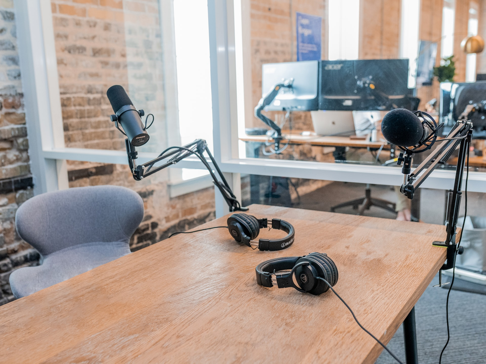

## Florida Young Guns Turning Heads in the Podcast Industry

Florida is home to some of the most innovative and creative minds in the podcast industry. These young guns are turning heads with their unique style of storytelling, combining humor and educational content with CGI visuals. From funny conversations about current events to deep dives into history, these Florida-based podcasters are bringing something new to the table. Whether you're looking for a good laugh or an interesting story, these Florida-based podcasts have something for everyone. 

We decided to sit down for a meme with these two internet veterans.

### What is the name of the new podcast company?
Media Might. We dare to be auspiciously great, will settle for next best.

### What kind of content will the podcast company be focusing on?
Edutainment with a focus on the classics. Sort of modernizing the subject matter to make it easily digestable and funny.

### How have two young guns been able to turn the industry on its head?
Simply put, we decided to start with a showstring budget and go from there. Our hope is to inspire others to put themselves out there, because everyone has a unique perspective on the world that many people can relate to.

> Launch is expected in the third quarter 2023, if not sooner. - Scott Pedrick

### What are some of the innovative features that this podcast company will offer?
We've been experimenting with 3D sets, fully equipped with cinematic lighting and authentic, life-like textures that are completely generated by computers.

### How has this new podcast company been able to generate so much buzz?
Honestly, it's been nearly impossible to keep the lid on this bad boy. We're humbled by the intrigue and anticipated a great response to our premier later this year.

### When can we expect this new podcast company to launch?
Launch is expected in the third quarter 2023, if not sooner.

### What sets this new podcast company apart from other existing companies in the industry?
Our staff are the hardest working people in the industry. I'm still awestruck with the ease in which they're envisaging our content. Not a dull day at work with so many exciting projects coming down the pipeline.

---
Thanks to all the staff and especially Scott and Nick from Media Might for generously taking time to speak with us. We look forward to seeing some content soon.

---

## 5 Budget Ideas When Starting A Podcast

Podcasting is an exciting and rewarding experience, but it can be intimidating when it comes to budgeting. Starting a podcast doesn't have to break the bank. 
> Price is what you pay. Value is what you get. - Warren Buffett

With careful planning and the right resources, you can create a professional-sounding podcast on a budget. In this article, we'll explore 5 budget ideas that will help you get started with your podcast without breaking the bank. We'll discuss topics such as set design, free editing software, chairs, recording video and audio, lighting, sound-proofing, topics for your show and website creation as well as how to find inspiration for your show.

###  1. Green Screen
Green Screen technology is a simple yet effective way to add a unique touch to any room. It allows you to create stunning visuals that can be used for art, photography, and video editing. The best part is that the walls are easy to store and transport, making them perfect for any space. With Green Screen technology, you can transform any room into an amazing work of art in no time at all.

### 2. DaVinci Resolve - Free Editing Software
DaVinci Resolve is a free and powerful editing software that is becoming increasingly popular amongst video editors. It has all the features of a professional editing suite, such as timeline editing, color grading, audio mixing and more. What makes DaVinci Resolve stand out is its user-friendly interface and its ability to work with different formats and platforms. With this free software, you can easily edit videos for YouTube, Vimeo or any other platform you might be using. It also supports 4K resolutions so you can create high-quality videos with ease. Whether you are a beginner or an experienced editor, DaVinci Resolve offers all the tools you need to create stunning videos quickly and easily.

### 3. Church Chairs
Church chairs are a great solution for podcast seating. They offer a cheap option for seating guests in a comfortable and stylish way. Church chairs come in various sizes and styles, making it easy to find the perfect chair for any podcast setting. They also provide excellent back support and are easy to move around when necessary. With church chairs, you can create the perfect atmosphere for your podcast guests while keeping costs low.

### 4. Recording Video
[10 Best Cameras for Recording a Podcast in 2023](./https://vlogtribe.com/best-cameras-for-recording-podcast/)

### 5. Audio 
[15 Best Budget Microphones for Podcasting & Streaming 2023](./https://improvepodcast.com/best-budget-microphone/)

From Tom Green and Norm Macdonald to Joe Rogan and Theo Von, Podcasts have been adopted on the main stage and have become an increasingly popular way for people to stay informed and entertained. But don't let the professional sets and engineering stop you from building your own platform. The biggest names in the game are just average people that began with a budget and built large followings.

---

## Analysis and Metrics

### Understanding the Data
SEO metrics in Google Analytics can help you track the performance of your website and measure the success of your SEO efforts. By monitoring engagement rate, measurements, landing pages, email sign-ups, retargeting and remarketing activities, you can gain valuable insights about how users interact with your website.

Engagement rate is an important metric that helps you understand how well people are engaging with your content. You can use it to track how much time they spend on each page of your website or blog post. Measurements like bounce rate and average session duration also provide valuable information about user engagement and reveal areas where improvements are needed.

Landing pages are another important SEO metric to monitor in Google Analytics. You can track which pages users land on when they enter your website and analyze which ones have the highest conversion rates. Additionally, tracking email sign-ups will give you an idea of how effective your lead generation campaigns are performing. 
