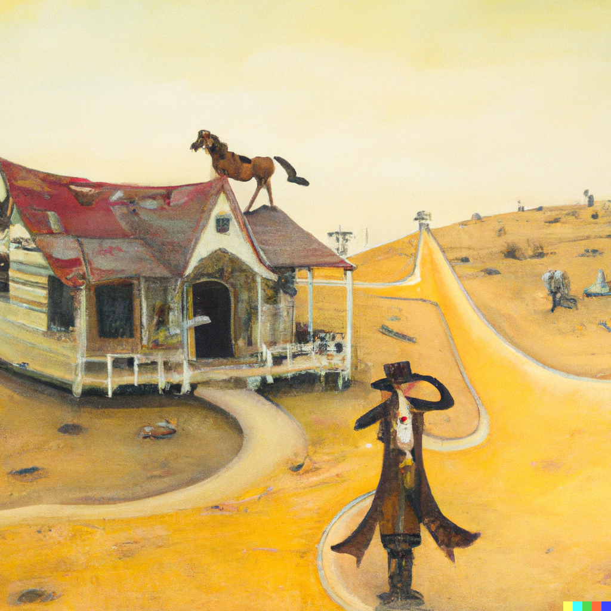
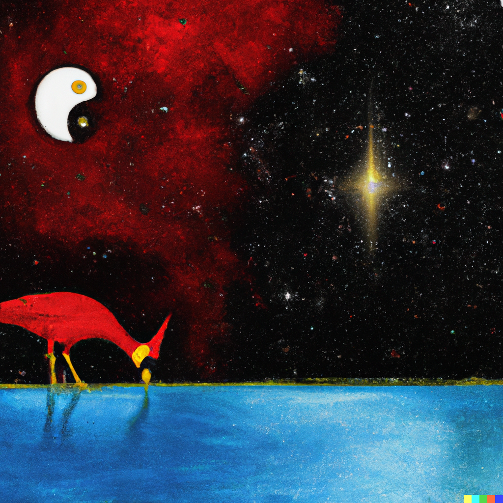

Hines Media Family is proud to have a team of experienced professionals with diverse backgrounds and expertise. From copywriters to designers, our team has over 40 years of combined experience in marketing and advertising. We are passionate about helping businesses reach their goals through effective digital campaigns that drive results.

---

## Our Team

### @ScottPedrick1  •  Director | Old Head
A domesticated wanderer and visionary on a mission to connect with honest people. Scott believes in living life by the heuristic that simplicity is perfection. 

> There are only two people who can tell you the truth about yourself - an enemy who has lost his temper and a friend who loves you dearly. - Antisthenes

### @K8theGr8Gma  •  Veep | Elder
A technophobe in the late 70's, later established a 40-year career in advertising and marketing. She was forced to embrace the machines, ultimately managing tech-driven video production, digital advertising and online marketing teams. 

> It is better to keep your mouth closed and let people think you are a fool than to open it and remove all doubt. - Mark Twain

### @pnedrick  •  Department of New Business Development
Mr. Nedrick has learned the age old lesson where the pen is mightier than the sword. His loyalty and commitment to excellence are just two of the three advantages he adds to our burgeoning firm. 

> I’m your huckleberry.  - Doc Holliday

