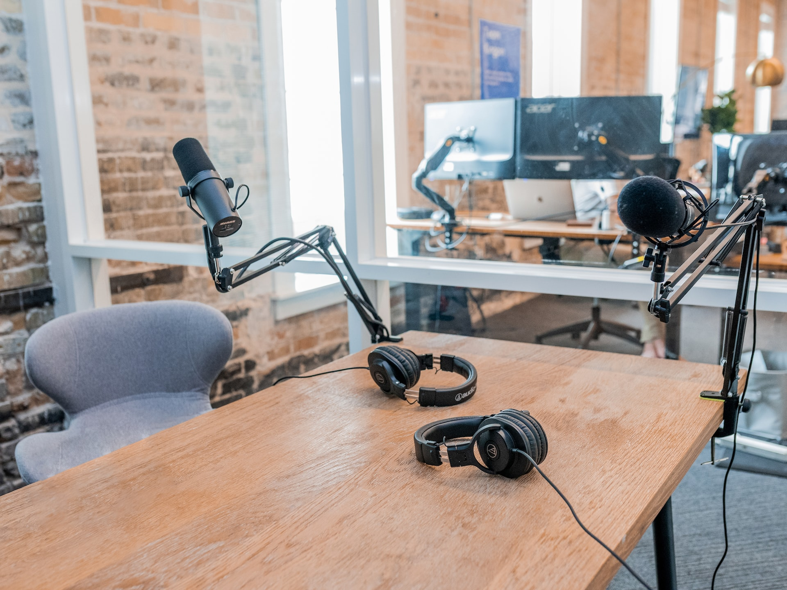

Podcasting is an exciting and rewarding experience, but it can be intimidating when it comes to budgeting. Starting a podcast doesn't have to break the bank. 
> Price is what you pay. Value is what you get. - Warren Buffett

With careful planning and the right resources, you can create a professional-sounding podcast on a budget. In this article, we'll explore 10 budget ideas that will help you get started with your podcast without breaking the bank. We'll discuss topics such as set design, free editing software, chairs, recording video and audio, lighting, sound-proofing, topics for your show and website creation as well as how to find inspiration for your show.

###  1. Green Screen
Green Screen technology is a simple yet effective way to add a unique touch to any room. It allows you to create stunning visuals that can be used for art, photography, and video editing. The best part is that the walls are easy to store and transport, making them perfect for any space. With Green Screen technology, you can transform any room into an amazing work of art in no time at all.

### 2. DaVinci Resolve - Free Editing Software
DaVinci Resolve is a free and powerful editing software that is becoming increasingly popular amongst video editors. It has all the features of a professional editing suite, such as timeline editing, color grading, audio mixing and more. What makes DaVinci Resolve stand out is its user-friendly interface and its ability to work with different formats and platforms. With this free software, you can easily edit videos for YouTube, Vimeo or any other platform you might be using. It also supports 4K resolutions so you can create high-quality videos with ease. Whether you are a beginner or an experienced editor, DaVinci Resolve offers all the tools you need to create stunning videos quickly and easily.

### 3. Church Chairs
Church chairs are a great solution for podcast seating. They offer a cheap option for seating guests in a comfortable and stylish way. Church chairs come in various sizes and styles, making it easy to find the perfect chair for any podcast setting. They also provide excellent back support and are easy to move around when necessary. With church chairs, you can create the perfect atmosphere for your podcast guests while keeping costs low.

### 4. Recording Video
[10 Best Cameras for Recording a Podcast in 2023](./https://vlogtribe.com/best-cameras-for-recording-podcast/)

### 5. Audio 
[15 Best Budget Microphones for Podcasting & Streaming 2023](./https://improvepodcast.com/best-budget-microphone/)

From Tom Green and Norm Macdonald to Joe Rogan and Theo Von, Podcasts have been adopted on the main stage and have become an increasingly popular way for people to stay informed and entertained. But don't let the professional sets and engineering stop you from building your own platform. The biggest names in the game are just average people that began with a budget and built large followings.